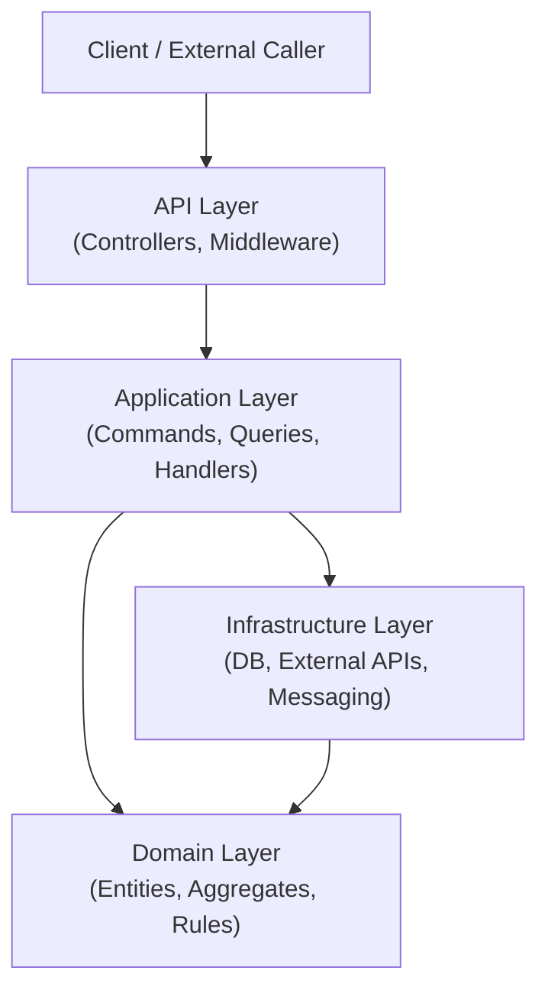
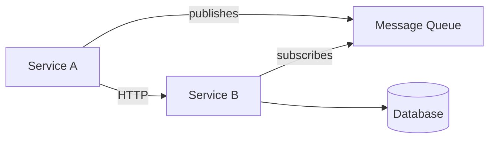

# Codebase Map Template

Contents: full worked example of the codebase-visualiser output format — example Mermaid diagrams, ASCII fallback diagram, and filled-in example tables for entry points, component relationships, data flow, domain language, and test state.

## Codebase Map: [Project Name]

**Stack:** [Language / Runtime / Framework / Key Libraries]

**In one sentence:** [What this codebase does and who uses it]

---

### Project Structure

```
Solution/
  src/
    Project.Api/              -- [purpose]
    Project.Application/      -- [purpose]
    Project.Domain/           -- [purpose]
    Project.Infrastructure/   -- [purpose]
  tests/
    Project.Tests/            -- [scope]
```

---

### Architecture Diagram

Prefer Mermaid — it renders inline and is easy to revise. Fall back to ASCII only when Mermaid cannot be rendered.

**Mermaid — layered architecture:**



**Mermaid — distributed services:**



**ASCII fallback:**

```
┌─────────────────────────────────┐
│           API Layer             │
│   (Controllers, Middleware)     │
└────────────────┬────────────────┘
                 │
┌────────────────▼────────────────┐
│       Application Layer         │
│  (Commands, Queries, Handlers)  │
└──────────┬──────────────┬───────┘
           │              │
┌──────────▼──────┐  ┌────▼───────────────┐
│  Domain Layer   │  │  Infrastructure    │
│ (Entities,      │  │  (DB, Messaging,   │
│  Rules)         │  │   External APIs)   │
└─────────────────┘  └────────────────────┘
```

Use the actual component names from the codebase. Adapt the shape to what is present — do not force a layered diagram onto a flat or service-oriented project.

---

### Entry Points

| Entry Point | File | Purpose |
|-------------|------|---------|
| API startup | `Program.cs:12` | Wires DI, middleware, routes |
| Background worker | `WorkerService.cs:8` | Processes queue messages |

---

### Component Relationships

| From | To | How | Notes |
|------|----|-----|-------|
| `OrderHandler` | `IOrderRepository` | DI / interface (`OrderHandler.cs:14`) | Defined in Domain, implemented in Infra |
| `OrderController` | `OrderHandler` | MediatR dispatch (`OrderController.cs:27`) | No direct coupling |
| `PaymentService` | Stripe API | HTTP client (`PaymentService.cs:31`) | Configured in `appsettings.json` |

Focus on non-obvious connections. Skip trivial or self-evident ones. Every row cites the file:line where the dependency is declared.

---

### Data Flow

Trace one representative request end-to-end using real class and method names.

```
POST /orders
  → OrdersController.CreateOrder()
  → MediatR → CreateOrderCommand → CreateOrderHandler
  → OrderRepository.SaveAsync()
  → SQL Server (via EF Core)
  → OrderCreatedEvent published → MassTransit → [subscribers]
```

---

### Architectural Pattern

**Pattern:** [Name or "unclear"]
**Evidence:** [What in the code indicates this pattern]
**Deviations:** [Where the code does not follow it consistently]

---

### Domain Language

| Concept | Where It Appears | Notes |
|---------|-----------------|-------|
| `Order` | `Domain/Orders/`, `Application/Orders/` | Core aggregate |
| `Customer` | `Domain/Customers/` | Referenced by Order |

---

### Test State

| Type | Location | Coverage Impression |
|------|----------|---------------------|
| Unit | `tests/Project.Tests/Unit/` | Good for domain layer |
| Integration | `tests/Project.Tests/Integration/` | Sparse |
| End-to-end | None found | — |

**Gaps:** [What appears untested based on folder/file inspection]

---

### Tech Debt Markers

- [ ] [File or area]: [What was observed]

---

### Open Questions

- [ ] [Thing that cannot be determined from static inspection alone]
