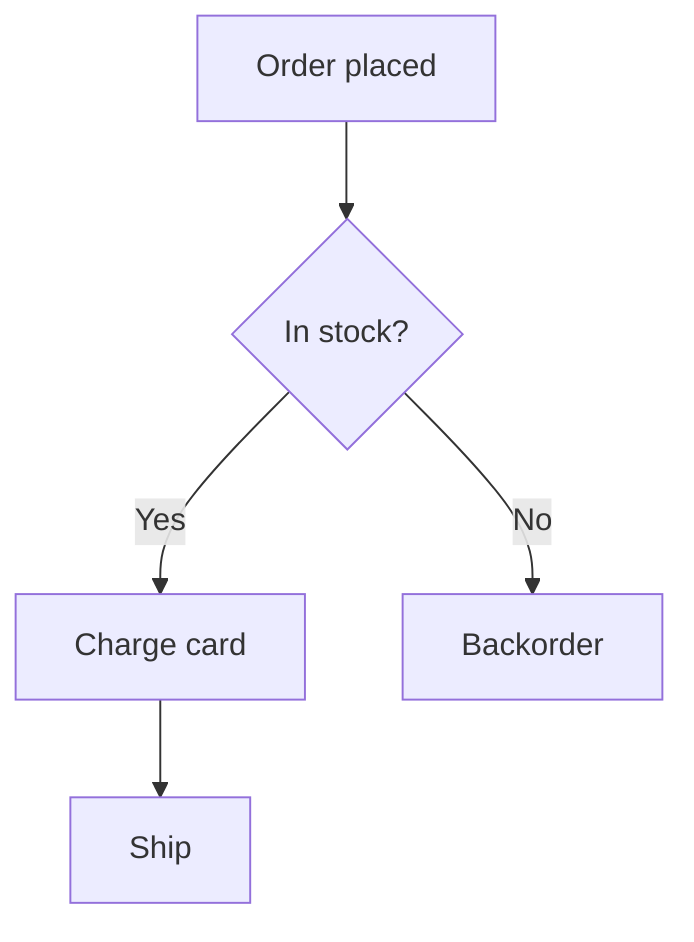

# Visualisation

## Use When

- The user wants a process or decision drawn: flowchart, swimlane, decision tree, state machine.
- The user wants interactions over time: sequence diagram, timeline, Gantt.
- The user wants a structure: ER diagram, class diagram, hierarchy/org chart, mind map.
- The user wants quantitative data charted: bar, line, pie, scatter, area.
- The user wants a quick mockup or concept sketch that is structural, not pictorial.

## Do Not Use When

- The diagram must reflect a real codebase's actual structure/flow — use **codebase-visualiser** (it verifies from source).
- The deliverable is an app screen, component, or design spec — use **ui-designer**.
- The deliverable is a picture, logo, or illustration — use **artwork-generation**.

## Inputs To Look For

- What is being depicted and the audience (exec summary vs engineering detail).
- The actual data, entities, steps, or relationships — gather them before drawing.
- Any required direction (top-down vs left-right), grouping, or emphasis.
- Output need: copy-pasteable Mermaid, a rendered inline widget, or both.

## Choosing The Diagram Type

Match the shape of the information to the diagram. Do not default to a flowchart for everything.

| The information is... | Use |
|---|---|
| A process or branching logic | Flowchart / decision tree |
| Messages between parties over time | Sequence diagram |
| Roles doing steps in a process | Swimlane / activity diagram |
| Entities and their relationships | ER diagram or class diagram |
| Lifecycle / modes and transitions | State diagram |
| A hierarchy or breakdown | Tree / mind map / org chart |
| A schedule over time | Gantt / timeline |
| Quantities, trends, proportions | Chart — see below |

**Chart type by data shape:** comparison across categories → **bar**; trend over time → **line**; part-to-whole (few parts) → **pie/donut**; relationship between two variables → **scatter**; cumulative over time → **area**. Avoid pie charts with many slices and dual-axis charts unless unavoidable.

## Rendering Route

| Need | Route |
|---|---|
| Standard diagram, want it portable and editable | **Mermaid** — renders inline and is easy to revise. Default choice. |
| Data chart, custom layout, dense/interactive, or precise styling | **Inline SVG/HTML widget** |
| Both portability and a polished rendered view | Provide Mermaid **and** a rendered widget |

## Process

1. **Clarify what and for whom.** One sentence: what should the viewer understand after seeing it?
2. **Gather and structure the inputs.** List the nodes/edges, entities/relations, or the actual numbers. Do not invent data points or relationships.
3. **Choose the diagram/chart type** (tables above) and state why in one line.
4. **Render** via Mermaid or an SVG/HTML widget. Render the Mermaid inline where the client supports it; if you cannot render, state that the syntax was checked by eye only.
5. **Verify accuracy.** Every node, edge, label, and data point traces to an input. Totals add up; axes are labelled; relationships are correct.

A *proposed or hypothetical* architecture (not yet in code) belongs here; an architecture that exists in a repo belongs to **codebase-visualiser**.
6. **Iterate** on clarity — reduce crossing lines, group related nodes, trim chartjunk.

## Output Format

A one-line caption ("What this shows: ..."), then the rendered diagram/chart. For Mermaid:

For data, include the source values used so the chart is reproducible.

## Quality Bar

- The diagram type fits the information shape — not a flowchart forced onto everything.
- Every node, edge, label, and number is traceable to a stated input; nothing invented.
- Charts have labelled axes/units, a clear title, and the correct chart type for the data shape.
- Mermaid is syntactically valid and renders; widgets render without errors.
- Layout is readable: minimal crossing edges, sensible grouping, no decorative clutter.

## Failure Modes To Avoid

- Inventing relationships or data points to fill the picture.
- Defaulting every request to a flowchart regardless of content.
- Pie charts with a dozen slices; 3D/exploded charts; unlabelled axes.
- Producing invalid Mermaid that fails to render.
- Drawing a real system's architecture from assumption — if it must be accurate to live code, hand to **codebase-visualiser**.

## Related Skills

- **codebase-visualiser** — when the diagram must reflect an actual codebase verified from source.
- **ui-designer** — when the artifact is an interface, not a diagram.
- **artwork-generation** — for pictorial/illustrative output rather than information graphics.
